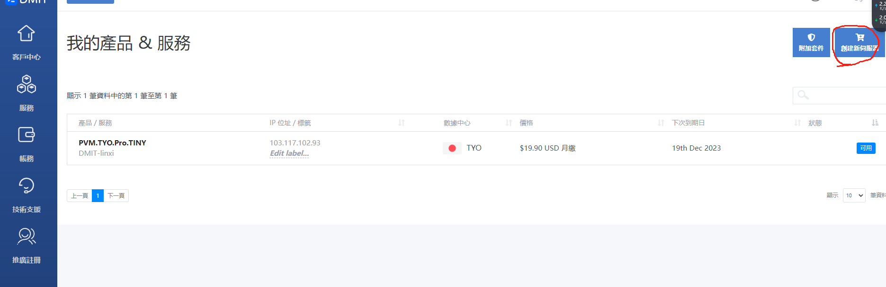
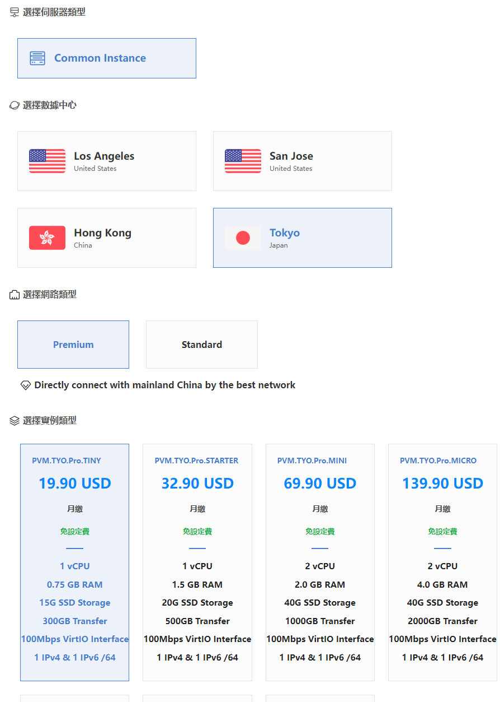
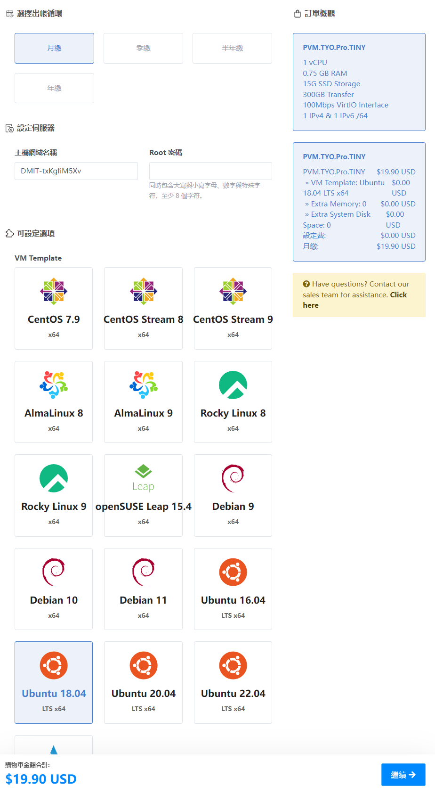
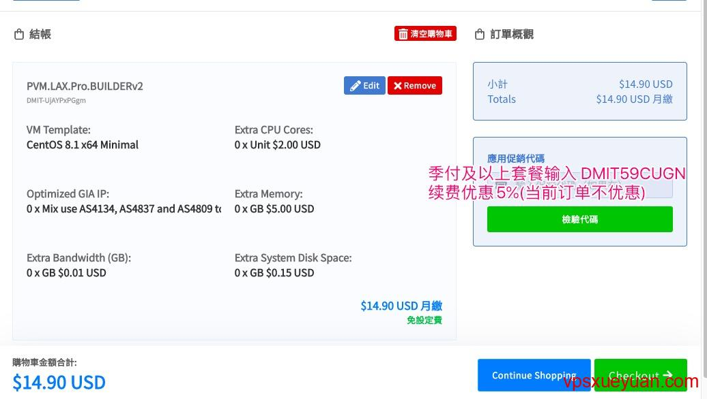
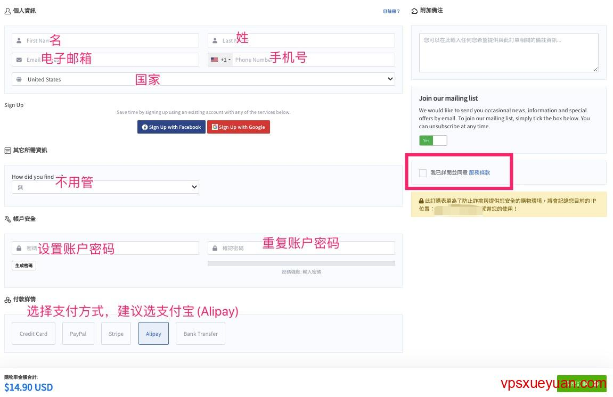
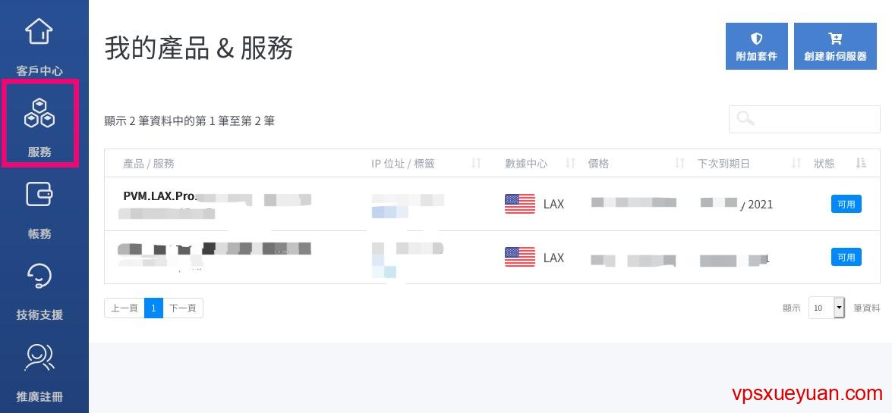
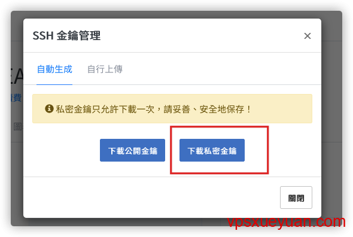
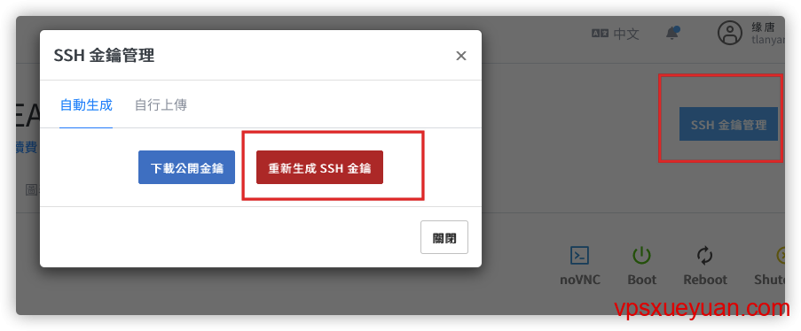

# 搭建N2N服务器

## 1.购买服务器（DMIT）

[vps教学地址](https://vpsxueyuan.com/dmit-vps-tutorial/)

[DMIT](https://www.dmit.io/aff.php?aff=1062&language=chinese) 是成立于2017年的美国土豪VPS商家，主营香港、洛杉矶大带宽[CN2 GIA VPS](https://vpsxueyuan.com/tag/cn2-gia-vps/)，官网是 [https://www.dmit.io](https://www.dmit.io/aff.php?aff=1062&language=chinese)。

1. 这家资费较贵，其他线路好的CN2 GIA VPS请参考：[CN2 GIA VPS和商家推荐](https://vpsxueyuan.com/cn2-gia-vps-merchants/)
2. DMIT有国人背景，发工单和回复可全程使用中文，但是对方会以英文回复
3. vps开通后没有滥用的情况下，三天内可退款

1. 首先打开 [DMIT官网](https://www.dmit.io/aff.php?aff=1062&language=chinese)，点击右边的“服务”-》“创建附加服务器”：



2.选择数据中心“tokyo”，选择网路类型“premium”，类型按需求（最低档和最高档带宽一致），点击下一步



3.这个界面主要选择缴费方式，设定root密码（对后续远程操作关键，后续登录默认使用root账号登录）以及服务器的系统（这里选择使用ubuntu 18.04），额外内存以及存储空间按需（一般不用）



4.服务器配置选好后，点击右下角的“继续”，进入确认页面。季付、半年付、年付可输入DMIT优惠码 `DMIT59CUGN` ，续费时能优惠5%（当前订单不优惠）；sPro CREATOR年付套餐填`Go-Build-A-Site`可享受85折优惠。点击“校验代码”使用优惠码



5.确认无误后，点击右下角的“Checkout”按钮，进入付款账单界面。在界面中填写名字、姓、电子邮箱（**非常重要**，一定要填写对），电话号码和选择国家。以上信息中，**除了邮箱**，其他信息可以使用假信息，但不能太随意（比如名字填aaaa就太过分了）。往下填写账户密码（**非常重要**，用来登录官网），选择付款方式和勾选服务条款：



6.确认信息填写正确后，点击右下角的“完成订购”，进入付款页面，按照提示完成付款即可。

## 2.DMIT连接服务器

1. [DMIT官网](https://www.dmit.io/aff.php?aff=1062&language=chinese) 点击右上角的“登录”（已登录则是“客户中心”），进入管理后台。点击左边的“服务”，查看订购的服务器：



2. 点击购买的服务器，首次进入会弹出下载密钥提示（也可以点击右上角的“SSH金钥管理”弹出来），点第二个“下载SSH密钥”按钮下载（第一个按钮的“下载公开金钥”基本上用不到）：



需要注意的是**SSH密钥只能下载一次**，没保存或者丢失只能重新生成：



3. 接下来，解压下载的密钥。“Private_key”文件夹下的”id_rsa.pem”便是密钥文件（id_rsa.ppk是另一种形式的密钥文件）。接着Windows用户请参考 [Bitvise连接Linux服务器教程](https://v2xtls.org/bitvise连接linux服务器教程/) 中的密钥连接部分，Mac用户请参考 [Mac电脑连接Linux教程](https://v2xtls.org/mac电脑连接linux教程/) 中的密钥连接部分，Linux用户请使用 `ssh -i 密钥文件 root@IP` 命令登录DMIT服务器。
4. 连接到服务器后，便可以执行建站或者安装科学上网脚本等命令了。

**对DMIT服务器不满意，在没有滥用（IP没被墙，使用流量没超过10GB等）的情况下，可发工单要求退款。**

## 3.使用bitvise链接linux（windows）

### 安装bitvise

1. 进 [Bitvise官网](https://www.bitvise.com/ssh-client-download) ，点击页面中的“Bitvise SSH Client Installer”，保存文件到电脑上。如果官网无法打开或下载速度慢，请从这里高速下载：[BvSshClient-Inst.exe](https://netfiles.pw/download.php?filename=/BvSshClient-Inst.exe)。
2. 双击下载的exe文件，弹出的安装界面中勾选“同意条款”，点击下方的“Install”开始安装：


3.黑框滚动，出现安装的日志，出现如下弹框说明安装成功：


4. 点击确定，安装界面消失，程序自动运行，同时桌面上出现“Bitvise SSH Client”的图标。

---

### Bitvise使用密码连接Linux服务器

1. 双击桌面上的Bitvise SSH Client图标，启动程序（首次安装完成后会自动运行）：


2. 填入服务器的ip、端口号(**默认是22**，搬瓦工默认不是22，请从后台查看)、用户名(**默认是root**)，”intial method”选“password”，在下面输入框输入密码（服务器密码在管理页面查看），同时勾选“sotre encrypted password in profile”。填好后建议点击左侧的“save profile as”按钮保存配置，下次使用时无需再填写。确认无误后，点击左下角的登录按钮，开始连接服务器。
3. 首次连接服务器会出现主机指纹确认，点击“Accept and Save”


​	4.如果没有出现这个页面，而是提示“由于连接方在一段时间后没有正确大幅或连接的主机没有反应，连接尝试失败”，说明ip被墙或者信息填写错误，请检查ip和端口号是否正确，如果没问题，说明ip被墙了。

5. 登录成功后，弹出两个窗口：黑乎乎的那个**是终端窗口，**用来输命令，另外一个像文件夹的是**sftp程序，**用来上传和下载文件：

   Ps：初始化之后，一开始无法直接登录，需要使用dmit 的终端对远程登录root账号权限解封，具体如下：

   注意，bitvise终端里面，选中即复制，右键单击粘贴

   ```bash
   vim /etc/ssh/sshd_config
   # 把PermitRootLogin 后续改成 Yes
   service ssh restar
   ```

## 4.安装小黄鸭服务器

项目地址

https://github.com/ntop/n2n

进去下载最新的3.0稳定服务包

n2n_3.0.0-1038_amd64.deb

使用终端窗口传送上去

```bash
sudo dpkg -i ./n2n_3.0.0-1038_amd64.deb
```

等待安装，安装完了修改配置文件

```bash
cd /etc/n2n
cp supernode.conf.sample supernode.conf
sudo vim supernode.conf 
```


-p后数字改成想要使用的端口并保存

加入-M参数，可以快速同一mac进行链接尝试

## 5.小黄鸭服务器启动和关闭

```bash
sudo systemctl start supernode # 启动
sudo systemctl status supernode # 查看状态
sudo systemctl restart supernode # 重启
sudo systemctl stop supernode # 关闭 
```


这样子就是正常启动了

记得开放端口或者防火墙策略吧对应端口开放

## 6.设置开机自启动以及定时开机


```bash
sudo vim /etc/rc.local
```

rc.local内容为

```bash
#!/bin/sh -e
 
sudo systemctl start supernode
```

给rc.local可执行权限

```bash
sudo chmod 777 rc.local
```

建立软连接

```bash
sudo vim /etc/systemd/system/rc-local.service #建立文件并打开
```

```bash
[Unit]
Description=/etc/rc.local Compatibility
Documentation=man:systemd-rc-local-generator(8)
ConditionFileIsExecutable=/etc/rc.local
After=network.target
 
[Service]
Type=forking
ExecStart=/etc/rc.local start
TimeoutSec=0
RemainAfterExit=yes
GuessMainPID=no
 
[Install]
WantedBy=multi-user.target
elias=rc-local.service
```

```bash
sudo chmod 777 /etc/systemd/system/rc-local.service #加权限
```

给另一个文件添加相同install字段（内容一样的）

```bash
sudo vim /lib/systemd/system/rc-local.service
```

```bash
[Install]
WantedBy=multi-user.target
elias=rc-local.service
```

```bash
sudo chmod 777 /lib/systemd/system/rc-local.service #加权限
```

将 /lib/systemd/system/rc-local.service 链接到 /etc/systemd/system/ 目录下面来

```bash
sudo ln -fs /lib/systemd/system/rc-local.service /etc/systemd/system/rc-local.service
```

启动systemctl服务

```bash
systemctl start rc-local
systemctl enable rc-local
```

这就好了。

最后重启等着自启动就好了。

## 7.定时重启

### 第一步：安装crontab

在Ubuntu系统中，crontab是设置定时任务的重要工具，因此第一步需要安装它。使用以下命令进行安装：

sudo apt-get install cron

如果已经安装过，可以使用以下命令更新：

sudo apt-get update

### 第二步：设置cron定时任务

在安装完crontab后，需要设置定时任务。使用以下命令打开编辑器：

crontab -e

在编辑器中，输入以下命令：

0 4 * * * reboot

**注意是太平洋时间！！！！**分钟、小时、日、月和周表示任务执行的时间，可以使用通配符*表示任意值。要执行的命令是需要定时执行的操作。

其中，“0 4 * * *”表示每天凌晨4点钟执行一次，而“reboot”则表示重启系统。如果要修改重启时间，可以修改前面的时间参数。

### 第三步：保存cron定时任务

保存定时任务后，使用以下命令即可退出编辑器：

Ctrl + X

在提示保存时，输入“Y”即可保存定时任务。

### 第四步：查看cron定时任务

使用以下命令可以查看已经设置的cron定时任务：

crontab -l

如果需要修改已经设置的定时任务，可以使用以下命令打开编辑器：

crontab -e

### 第五步：测试cron定时任务

为了确保设置的定时任务能够正常工作，可以使用以下命令进行测试：

sudo shutdown -r now

该命令会立即重启系统，如果系统能够正常重启，则表示定时任务能够正常工作。