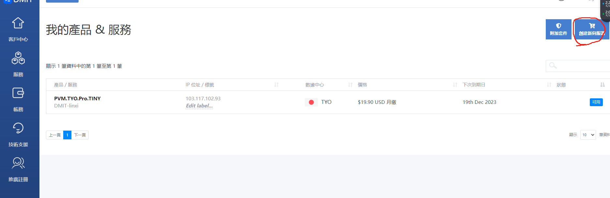
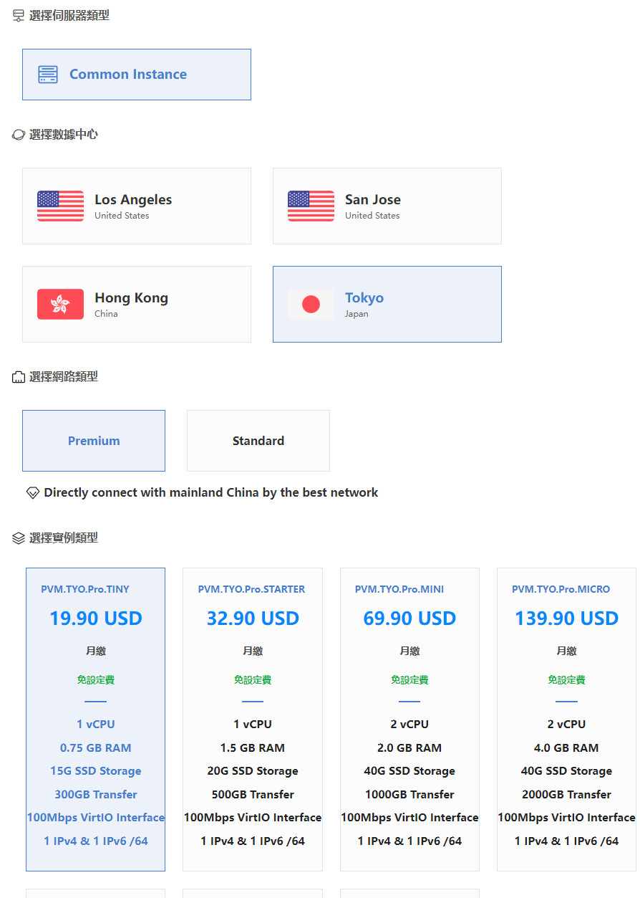
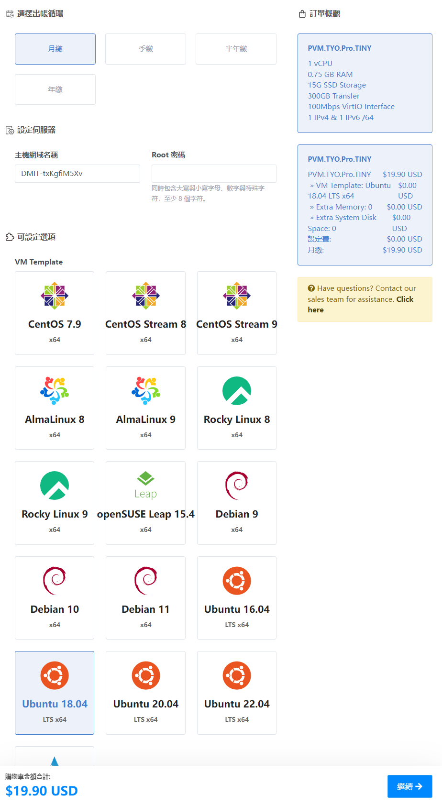
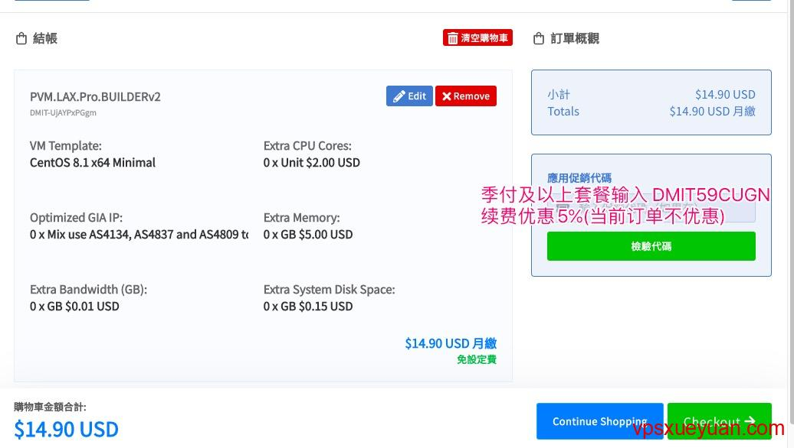
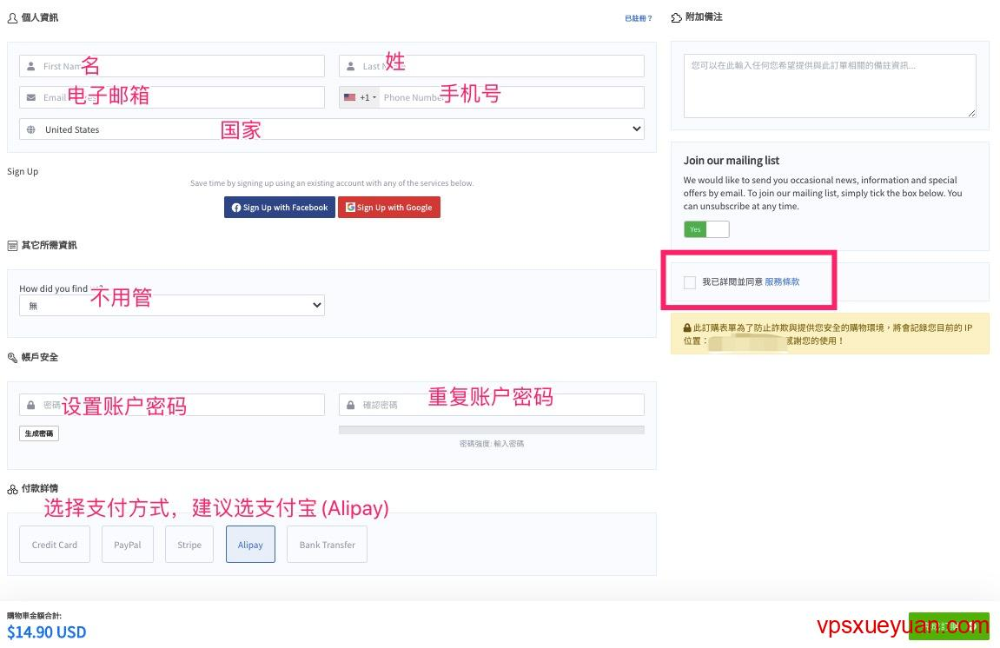
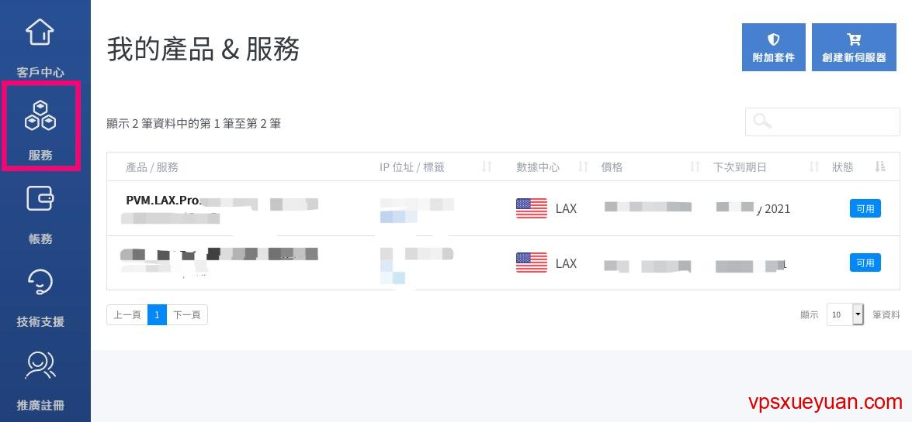
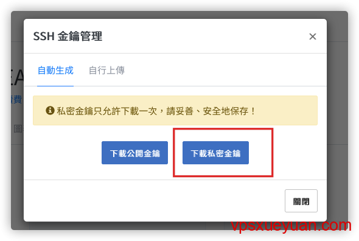
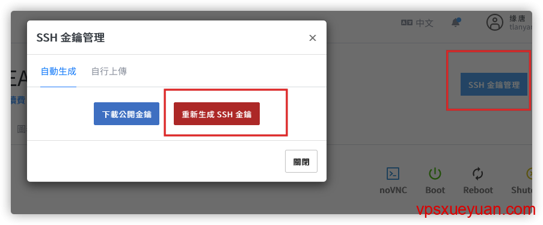

# 搭建N2N服务器

## 1.购买服务器（DMIT）

[vps教学地址](https://vpsxueyuan.com/dmit-vps-tutorial/)

[DMIT](https://www.dmit.io/aff.php?aff=1062&language=chinese) 是成立于2017年的美国土豪VPS商家，主营香港、洛杉矶大带宽[CN2 GIA VPS](https://vpsxueyuan.com/tag/cn2-gia-vps/)，官网是 [https://www.dmit.io](https://www.dmit.io/aff.php?aff=1062&language=chinese)。

1. 这家资费较贵，其他线路好的CN2 GIA VPS请参考：[CN2 GIA VPS和商家推荐](https://vpsxueyuan.com/cn2-gia-vps-merchants/)
2. DMIT有国人背景，发工单和回复可全程使用中文，但是对方会以英文回复
3. vps开通后没有滥用的情况下，三天内可退款

1. 首先打开 [DMIT官网](https://www.dmit.io/aff.php?aff=1062&language=chinese)，点击右边的“服务”-》“创建附加服务器”：

2.选择数据中心“tokyo”，选择网路类型“premium”，类型按需求（最低档和最高档带宽一致），点击下一步

3.这个界面主要选择缴费方式，设定root密码（对后续远程操作关键，后续登录默认使用root账号登录）以及服务器的系统（这里选择使用ubuntu 18.04），额外内存以及存储空间按需（一般不用）

4.服务器配置选好后，点击右下角的“继续”，进入确认页面。季付、半年付、年付可输入DMIT优惠码 `DMIT59CUGN` ，续费时能优惠5%（当前订单不优惠）；sPro CREATOR年付套餐填`Go-Build-A-Site`可享受85折优惠。点击“校验代码”使用优惠码

5.确认无误后，点击右下角的“Checkout”按钮，进入付款账单界面。在界面中填写名字、姓、电子邮箱（**非常重要**，一定要填写对），电话号码和选择国家。以上信息中，**除了邮箱**，其他信息可以使用假信息，但不能太随意（比如名字填aaaa就太过分了）。往下填写账户密码（**非常重要**，用来登录官网），选择付款方式和勾选服务条款：

6.确认信息填写正确后，点击右下角的“完成订购”，进入付款页面，按照提示完成付款即可。

## 2.DMIT连接服务器

1. [DMIT官网](https://www.dmit.io/aff.php?aff=1062&language=chinese) 点击右上角的“登录”（已登录则是“客户中心”），进入管理后台。点击左边的“服务”，查看订购的服务器：

2. 点击购买的服务器，首次进入会弹出下载密钥提示（也可以点击右上角的“SSH金钥管理”弹出来），点第二个“下载SSH密钥”按钮下载（第一个按钮的“下载公开金钥”基本上用不到）：

需要注意的是**SSH密钥只能下载一次**，没保存或者丢失只能重新生成：

3. 接下来，解压下载的密钥。“Private_key”文件夹下的”id_rsa.pem”便是密钥文件（id_rsa.ppk是另一种形式的密钥文件）。接着Windows用户请参考 [Bitvise连接Linux服务器教程](https://v2xtls.org/bitvise连接linux服务器教程/) 中的密钥连接部分，Mac用户请参考 [Mac电脑连接Linux教程](https://v2xtls.org/mac电脑连接linux教程/) 中的密钥连接部分，Linux用户请使用 `ssh -i 密钥文件 root@IP` 命令登录DMIT服务器。
4. 连接到服务器后，便可以执行建站或者安装科学上网脚本等命令了。

**对DMIT服务器不满意，在没有滥用（IP没被墙，使用流量没超过10GB等）的情况下，可发工单要求退款。**